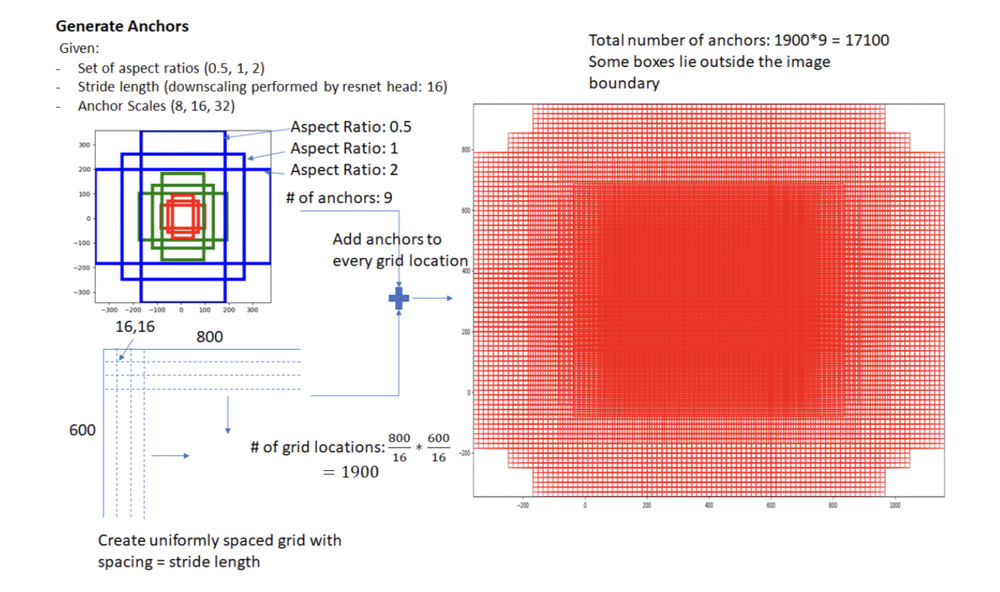
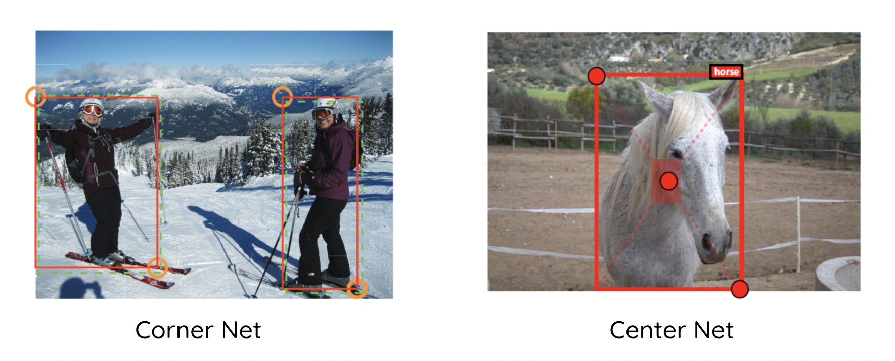
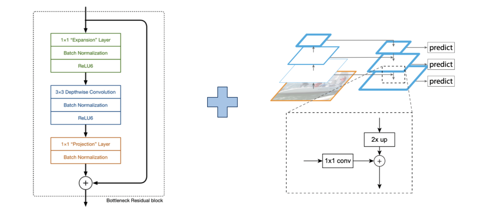
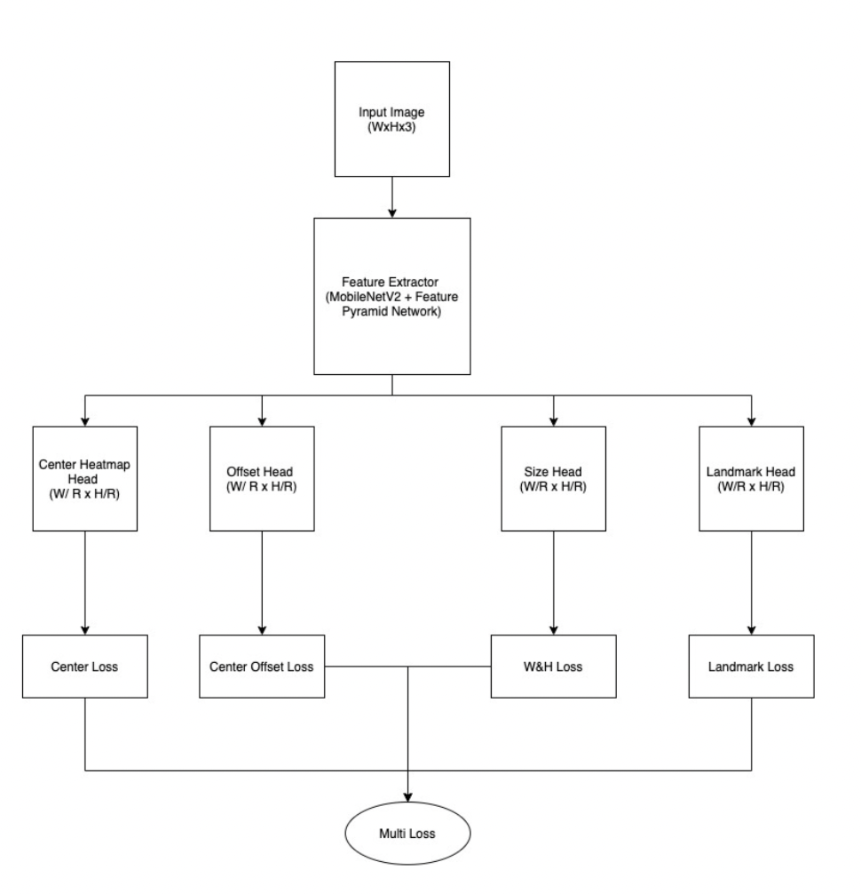
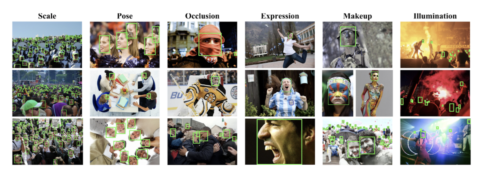
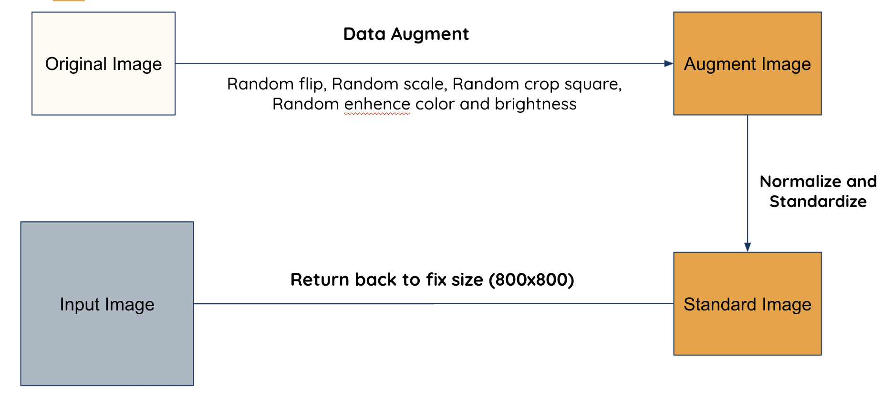
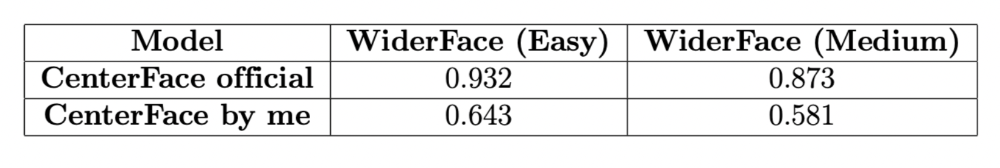

# CenterFace
An free anchor method for Object Detection Problem

## Motivation
These existed approaches of Object Detection mainly focus on anchor method, such as Faster RCNN, SSD or YOLO, which created several prior boxes to detect whether a location have box or not. 

However, anchor method still has some drawbacks, such as high complexity in creating lots of prior boxes, or not flexible in general situation. In the case below, the model has to created more than 17,000 prior box for the whole images !

To overcome these drawbacks, the free anchor method represent object as point and and features instead. Two typical models using this method are Corner Net and Center Net, which respectively represents object as 2 corner points and center points.

Inspiring by these two models, CenterFace was created to solve a more specific problem, the Face Detection problem.

## Architecture
The architecture made of 2 main module, the backbone with MobileNetV2 and the neck with Feature Pyramid Network to enrich the feature maps extracted from the backbone

### Training pipeline 

The model outputs with 4 for heads, which are center loss, offset loss, size loss and landmark loss respectively

## Dataset

In this work, I use WIDER FACE dataset, which is a benchmark dataset for Face Detection task. The dataset includes 12,880 images with more than 150,000 valid faces in scale, pose, expression, occlusion and illumination 

## Data Augment 

## Result 

The model still achives a quite low result on the WIDER FACE dataset compares to the original model from the paper

